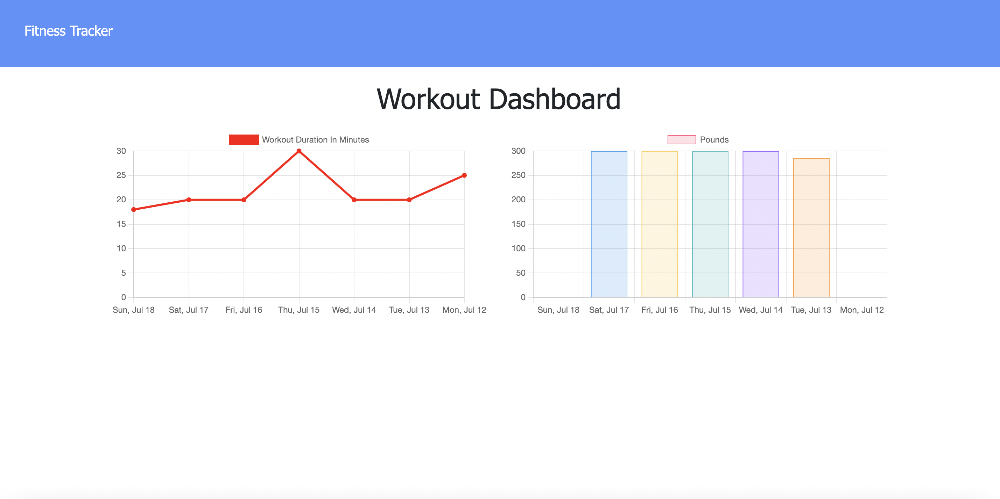

# workout-tracker

## Description

A full-stack app for tracking your workouts, utilising MongoDB, Express, and Javascript. This app allows you to retrieve all workouts, show your exercise stats from the last 7 workouts, add new exercises, and create new workouts.

## What did I do?

- Used the express server
- Used mongoDB and mongoose for the database and allow a user to retrieve all workouts, see their latest workouts, see stats from the last 7 workouts and add a new exercise and workout
- Used mongoose to create a Workout model
- Used sendfile to send the workout and exercise data and render it on the page
- Used try/catch for error handling
- Used the .aggregate method to total the duration of the last 7 workouts and provide stats to help the user stay on top of their workout schedule

## Usage & Installation

Feel free to clone my repo and do a npm i to install all of the necessary packages. Once you have installed the packages, type npm run dev to see the app in action.

## License

MIT

## Screenshots

## Link to deployed application:

https://workout-tracker-2021.herokuapp.com/
